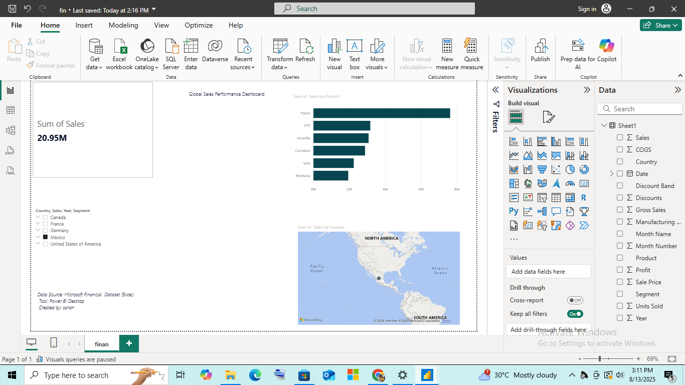

# Global Sales Performance Dashboard

This project is a Power BI dashboard built from Microsoft's Financial Sample dataset.

## Features
- KPI cards for Total Sales
- Sales by Product (Bar Chart)
- Sales by Country (Map)
- Interactive filters by Year and Segment

## Tools Used
- Power BI Desktop
- Excel

## Screenshot

## How to Use
Download the `.pbix` file and open in Power BI Desktop.
